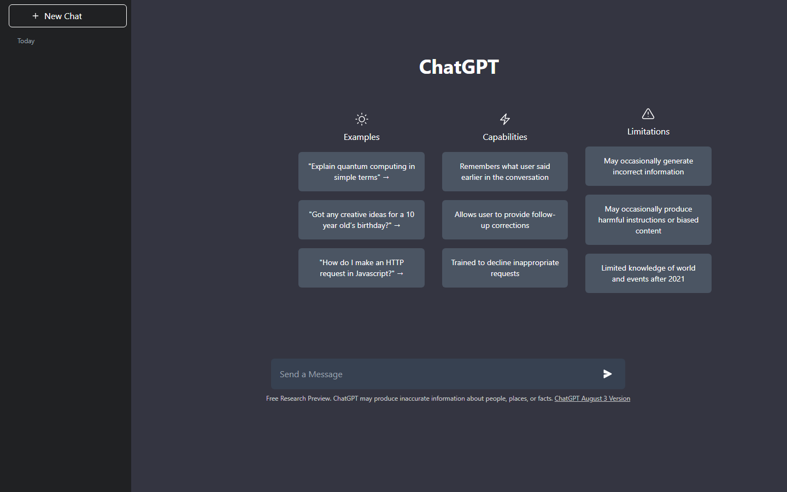
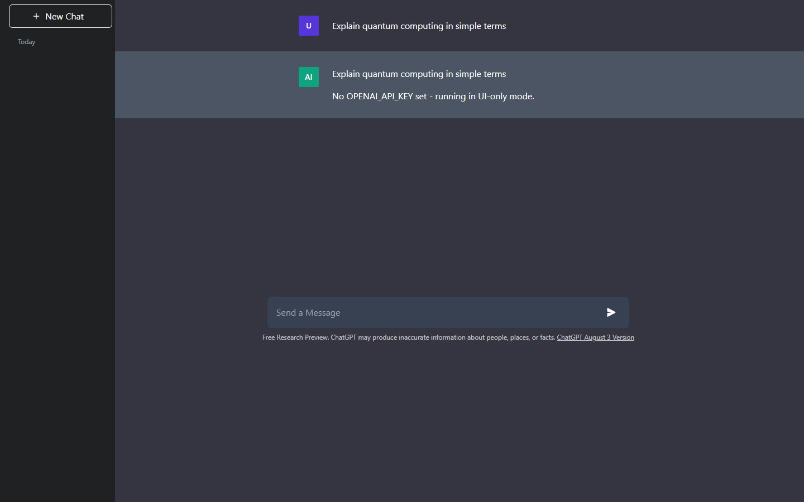

# ChatGPT Clone

A ChatGPT web UI clone built with **Flask**, **Tailwind CSS**, and **MongoDB**, wired to the OpenAI API.

It recreates the classic ChatGPT layout - the sidebar with chat history, the
Examples / Capabilities / Limitations landing screen, and the two-tone message
thread - and caches every question and answer in MongoDB, so a repeated question
is served from the database instead of hitting the API again.

The goal is a faithful front-end clone backed by a small but complete Flask
service: one page to render the interface, one JSON endpoint to answer
questions, and a database layer that doubles as a cache. It is deliberately
compact - a single `main.py`, one HTML template, and a sprinkle of vanilla
JavaScript - so it is easy to read end to end and adapt.

## Screenshots

### Landing screen



The opening view, styled after ChatGPT's own welcome page. A dark sidebar on the
left holds the **New Chat** button and the running list of past questions pulled
from MongoDB. The main area centres the **ChatGPT** title over three columns -
**Examples**, **Capabilities**, and **Limitations** - each with sample cards,
and a **Send a Message** input pinned along the bottom.

### Chat view



After you send a message the landing panel is swapped out for the conversation
thread. Your question appears in a plain row with a violet **U** avatar; the
reply sits below it on a lighter band with a green **AI** avatar. The two-tone
striping is the same trick the real ChatGPT uses to separate speaker turns.

> The answer above reads "No OPENAI_API_KEY set" because the app was started
> without a key, in UI-only mode. With a key configured, the model's reply
> renders in that spot instead. The avatars are drawn as CSS badges rather than
> external images, so the interface has no third-party dependencies at runtime.

## Features

- ChatGPT-style dark UI, built with Tailwind, with a landing screen and a chat thread
- Ask a question and get an answer from the OpenAI Chat Completions API
- Answers cached in MongoDB - a repeated question is served from the DB, no API call and no extra cost
- Past questions listed in the sidebar, loaded from the database on page load
- Graceful degradation: runs with no API key and no database, so the UI can be developed on its own
- Configuration is entirely environment-driven - no keys, models, or connection strings hardcoded
- Avatars rendered as CSS badges, so the page makes no third-party requests

## Tech stack

| Layer    | Tool                          |
|----------|-------------------------------|
| Backend  | Flask                         |
| Frontend | Tailwind CSS, vanilla JS      |
| Database | MongoDB (via Flask-PyMongo)   |
| AI       | OpenAI Chat Completions API   |

## Getting started

### 1. Clone and install

```bash
git clone https://github.com/DharamVeer970/Chatgpt-Clone.git
cd Chatgpt-Clone

pip install -r requirements.txt
npm install
```

### 2. Configure

Copy the example file and fill in what you have:

```bash
cp .env.example .env
```

Nothing in it is required - any value you leave blank simply disables that
feature, and the app still runs.

| Variable         | Blank means                                       |
|------------------|---------------------------------------------------|
| `OPENAI_API_KEY` | UI-only mode, no real answers                     |
| `OPENAI_MODEL`   | UI-only mode - set it to the model you want       |
| `MONGO_URI`      | No chat history, no answer caching                |

Nothing is hardcoded in the app - the model is whatever you put in `.env`. To
get real answers you need both a key and a model.

A filled-in `.env` looks like this:

```ini
OPENAI_API_KEY=sk-...
OPENAI_MODEL=gpt-4o-mini
MONGO_URI=mongodb+srv://<user>:<password>@<cluster>/Chatgpt
```

Real environment variables also work and take precedence over `.env`, which is
handy in production.

> **Never commit your API key or connection string.** `.env` is already in
> `.gitignore` - keep your real values there, and only ever commit
> `.env.example`.

### 3. Run

```bash
python main.py
```

Open <http://127.0.0.1:5000>.

To rebuild the CSS after editing Tailwind classes, run this in a second terminal:

```bash
npm run tailwind
```

## UI-only mode

With no `OPENAI_API_KEY` and no `MONGO_URI`, the app still starts and the whole
interface works - the landing screen renders, the send button switches to the
chat view, and the reply bubble fills with a placeholder instead of a model
answer. This is how the screenshots above were taken, and it's the easiest way
to work on the front end without spending API credits.

## Project structure

```
Chatgpt-Clone/
|-- main.py                 # Flask app: routes, OpenAI call, MongoDB cache
|-- templates/
|   `-- index.html          # Landing screen + chat view
|-- static/
|   |-- js/script.js        # Send button -> POST /api -> render answer
|   |-- input.css           # Tailwind source
|   `-- css/main.css        # Compiled Tailwind output
|-- requirements.txt
`-- package.json            # Tailwind build
```

## How it works

1. `GET /` renders `index.html`, passing in past chats from MongoDB for the sidebar.
2. Clicking send fires `POST /api` with `{"question": "..."}` from `script.js`.
3. The server checks MongoDB for that exact question. On a hit, it returns the
   stored answer immediately.
4. On a miss, it calls the OpenAI Chat Completions API, stores the answer, and
   returns it.
5. The browser swaps the landing panel for the chat panel and renders the answer.

## License

ISC
